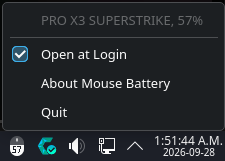

# Mouse Battery

Mouse Battery shows the battery level of your Logitech mouse in the system tray on Linux. It warns you once at 10% and once more at 5% on each charge, and once more after a login or an update while the mouse is still low. When you have more than one mouse, it follows the one you're using.



Mouse Battery isn't affiliated with Logitech.

## Install

On Ubuntu and Debian, download the `.deb` from the [latest release](https://github.com/kymotsujason/logitech-mouse-battery-tray-icon/releases/latest) and double click it, or install it from a terminal:

```bash
sudo apt install ./logitech-mouse-battery_1.1.0_all.deb
```

On Fedora, download the `.rpm` from the same page:

```bash
sudo dnf install ./logitech-mouse-battery-1.1.0-1.noarch.rpm
```

On Arch, download the `.pkg.tar.zst` from the same page and install it with pacman:

```bash
sudo pacman -U ./logitech-mouse-battery-1.1.0-1-any.pkg.tar.zst
```

An AUR package is ready and will follow once the AUR opens account registrations again.

The package also installs a udev rule that hands your receiver or cable to Mouse Battery's service, and applies it to devices that are already plugged in, so there's no need to replug anything.

## Use

Installing doesn't start Mouse Battery, so open "Mouse Battery" from your app menu once and its icon shows up in the tray. From the next login on it starts by itself, for every account on the computer, whether or not that account ever opened it, until that account turns off "Open at Login" in its menu.

The icon is a mouse that fills up with the battery level and shows the percentage. The fill turns green while the mouse charges, red at 20% or below, and gray while the mouse sleeps. The menu lists every mouse it found, for example:

- `PRO X3 SUPERSTRIKE, 69%`
- `PRO X3 SUPERSTRIKE, charging, 82%`
- `PRO X3 SUPERSTRIKE, asleep, 69% at 21:40`

Opening the menu takes a fresh reading from each mouse it reads over HID++, while UPower keeps the others current on its own. A mouse that has gone to sleep shows its last reading and the time it was taken.

## GNOME

GNOME's top bar has no system tray of its own, so Mouse Battery needs the AppIndicator extension there. When it can't find a tray, it sends a notification with a button that turns the extension on, or opens the extension's page when it isn't installed. The same notification has a "Don't Open at Login" button, since without a tray there's no menu to turn that off from.

## Check from a terminal

`logitech-mouse-battery check` prints each mouse it can read with its battery, and says what to do when it can't read one.

## Which mice work

Mouse Battery reads mice in two ways:

- Mice the Linux kernel already drives, such as most Unifying, LIGHTSPEED, and Bluetooth mice, are read through UPower.
- Mice on a receiver or cable the kernel leaves alone are read over Logitech's HID++ protocol by a small system service, which alone may open the receiver. That covers the PRO X3 SUPERSTRIKE's receiver (`046d:c54f`) and USB cable (`046d:c0a9`), and on kernels that don't drive them, receivers such as the LIGHTSPEED `046d:c547` and the Logi Bolt `046d:c548`.

It has been tested with the PRO X3 SUPERSTRIKE on its receiver and on its cable, and by one tester with a PRO X Wireless on a `046d:c547` receiver and an MX Master 3S on a Logi Bolt receiver (see "Not tested" below).

## What the udev rule allows

The rule hands the HID++ interface of any Logitech USB device that the kernel leaves to its generic HID driver, such as a receiver or a mouse on its cable, to the `logitech-mouse-battery` group, when that interface's report descriptor passes the app's own check. The check rejects any interface with a keyboard, keypad, or mouse collection and any receiver interface that carries a paired keyboard's keystrokes. Only Mouse Battery's service runs in that group, as its own system user in a systemd sandbox, and it offers nothing but battery readings on the system bus. Any local user may read those readings and ask for a new read, which the service runs at most once a second, but nothing this package installs lets a program you run open the receiver or send it HID++ commands.

One limit stays after an upgrade from 1.0.x. A program that already had a receiver or cable open when the upgrade was installed keeps that open handle until it closes it, since Linux checks access when a file is opened. Unplugging it and plugging it back in, or restarting, ends it.

## Uninstall

Remove the package the way you installed it, with Discover, GNOME Software, `sudo apt remove logitech-mouse-battery`, `sudo dnf remove logitech-mouse-battery`, or `sudo pacman -R logitech-mouse-battery`. The running app notices and quits within a few seconds.

Mouse Battery keeps no settings. The one file it can leave behind is `~/.config/autostart/logitech-mouse-battery.desktop`, which it writes only when you turn off "Open at Login", and which does nothing once the app is gone. The service's group keeps its access to a plugged in receiver or cable until you replug it or restart, and the `logitech-mouse-battery` system user stays, as package managers leave system users in place.

## Not tested

These haven't been tested yet:

- The GNOME, GNOME Classic, GNOME Flashback, XFCE, Cinnamon, MATE, Budgie, and LXQt desktops
- Mice other than the PRO X3 SUPERSTRIKE, the PRO X Wireless, and the MX Master 3S
- Any Logitech mouse through UPower
- Bluetooth mice
- Light app themes on panels that stay dark outside Plasma and GNOME
- Double click installs in Ubuntu's App Center and GNOME Software
- An Open at Login override that another tool wrote with GNOME's `X-GNOME-Autostart-enabled` key
- The `.deb` and `.rpm` on a real Debian, Ubuntu, or Fedora desktop, including the rule applying without a replug (only clean containers have run them, plus the `.deb` on GitHub's Ubuntu runner with a fake receiver)
- The service on a booted Debian, Fedora, or Arch system before release, since only GitHub's Ubuntu runner and clean containers run it automatically

Apart from these, two limits are known. A mouse that reports its battery without a percentage draws a full icon and never warns, while its menu line shows what it reported instead, such as a level name. A mouse on a receiver the kernel leaves alone also keeps showing as awake with its last reading after it's turned off, until the app next reads it (every 5 minutes, or when you open the menu or click the icon), since the receivers tested so far don't announce a mouse turning off.

## Code layout

The app is the flat set of modules in `src/`, which the packages install side by side in `/usr/share/logitech-mouse-battery/`:

- `tray.py` starts the app and owns the tray icon, its menu and tooltip, Open at Login, and About.
- `service.py` is the battery service, the only part that opens receivers and cables, which serves their readings on the system bus.
- `receivers.py` finds, opens, and reads the receivers and cables in the service, with a worker thread for each HID++ node.
- `serviceState.py` is the state the service sends and the tray reads.
- `serviceClient.py` follows the service from the tray.
- `clearAccess.py` closes the access 1.0.x gave plugged in receivers and cables, when the package is installed.
- `exceptionHooks.py` prints an exception in a slot or a thread instead of ending the app or the service.
- `trayHost.py` waits for a system tray and sends a notice when none shows up.
- `installWatch.py` quits the app when it's uninstalled and restarts it into a new version after an update.
- `mice.py` keeps the tray's list of mice, merging HID++ and UPower readings by mouse, with the status and the 5 minute read.
- `hidpp.py` speaks Logitech's HID++ protocol over hidraw.
- `hidDescriptor.py` checks a HID report descriptor, for discovery and for the udev rule.
- `isHidpp.py` is the check the udev rule runs.
- `upower.py` reads the mice the kernel drives through UPower.
- `lowBattery.py` decides when a mouse gets a low battery warning.
- `notify.py` sends desktop notifications.
- `dbusCalls.py` makes every blocking D-Bus call, each with a timeout.
- `panelColor.py` works out the color the icon is drawn in, from the desktop's theme.
- `icon.py` draws the tray icon.
- `autostart.py` turns Open at Login on and off.
- `check.py` is the terminal check.
- `version.py` holds the version.

`packaging/` holds the launcher, the desktop entries, the udev rule, the service's systemd, D-Bus, and sysusers files, the install scripts, the package configs, and the build scripts. `tests/` holds the unit tests, with the fake devices and D-Bus services in `tests/fakes/`, the checks that run the real tray on private buses in `tests/live/`, the container checks in `tests/containers/`, and the check that runs the packaged service on a booted runner in `tests/booted/`.

## Build from source

The app is plain Python and needs Python 3.11 or later with PyQt6 on Qt 6.4 or later. The tests run with:

```bash
python3 -m unittest discover -s tests -t .
```

`packaging/build.sh` builds the `.deb` and `.rpm` into `dist/` with nfpm's Docker image. `packaging/tarball.sh` builds the release tarball from the last commit, and `packaging/buildArch.sh` builds the Arch package from it. `tests/containers/testPackages.sh` installs each package in a clean container, checks it, and removes it again.

To install from a clone instead of a release, build the package for your distro with Docker running, then install the file it leaves in `dist/`. On Arch that's:

```bash
packaging/tarball.sh
packaging/buildArch.sh
sudo pacman -U dist/logitech-mouse-battery-1.1.0-1-any.pkg.tar.zst
```

On Debian, Ubuntu, or Fedora, run `packaging/build.sh` and install `dist/logitech-mouse-battery_1.1.0_all.deb` with `sudo apt install` or `dist/logitech-mouse-battery-1.1.0-1.noarch.rpm` with `sudo dnf install`, giving the path with a leading `./`.

To release a new version, run `python3 packaging/bumpVersion.py <VERSION>`, where `<VERSION>` is the new version number. It updates every file that carries the version, and the tests fail if any of them disagree. Then commit and push to `main`, and the release workflow builds, tests, and publishes `v<VERSION>` with the packages attached, since that version has no release yet. A push that keeps the version publishes nothing.

## License

Mouse Battery is licensed under the GNU General Public License, version 3 or later (see `LICENSE`). The bundled Noto Sans Medium font is under the SIL Open Font License 1.1 (see `src/OFL.txt`).
